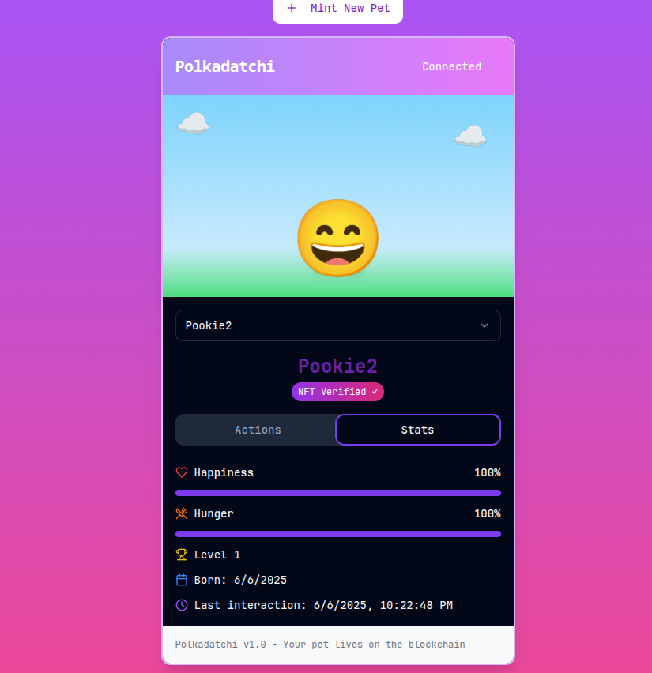

# 🐾 Polkadatchi

Your virtual pet living on the Polkadot blockchain! 


## 🌟 Features

- 🎮 **Interactive Pet Care**: Feed and play with your virtual pet to maintain its happiness and hunger levels
- 🔄 **Dynamic Stats**: Pet stats decay over time, requiring regular attention and care
- 🎯 **Life & Death**: Keep your pet's stats above zero to ensure its survival
- 🌐 **Blockchain-Based**: Every pet is a unique NFT on the Polkadot network
- 💎 **Affordable**: Mint your own pet for just 0.01 DOT


# Screenshot showcase! 





## 🚀 Getting Started

1. **Install Dependencies**
   ```bash
   npm install
   ```

2. **Run Development Server**
   ```bash
   npm dev
   ```

3. **Connect Your Wallet**
   - Connect your Polkadot-compatible wallet(Metamask)
   - Ensure you have enough DOT for minting

4. **Mint Your Pet**
   - Click "Mint New Pet"
   - Choose a name for your pet
   - Pay the minting fee (0.01 DOT)

## 🎮 How to Play

1. **Feed Your Pet**
   - Click the "Feed" button to increase hunger stat by 20 points
   - Maximum stat value is 100

2. **Play with Your Pet**
   - Click the "Play" button to increase happiness by 15 points
   - Keep your pet entertained!

3. **Monitor Stats**
   - Watch your pet's hunger and happiness levels
   - Stats decay by 1 point per hour
   - Don't let any stat fall to 0!

## 🛠 Technical Stack

- **Frontend**: Next.js, TypeScript, Tailwind CSS
- **Blockchain**: Polkadot/Substrate
- **Smart Contract**: Solidity
- **Styling**: Radix UI Components

## 🤝 Contributing

Contributions are welcome! Please feel free to submit a Pull Request.

## 📄 License

This project is licensed under the Apache-2.0 License - see the [LICENSE](LICENSE) file for details.

---

Made with ❤️ by [AaravAtGit](https://github.com/AaravAtGit)
